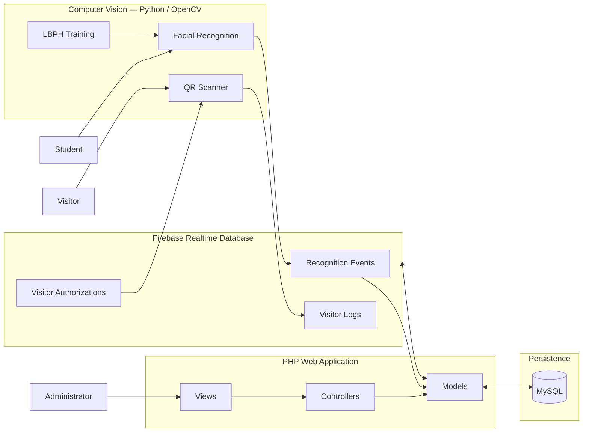
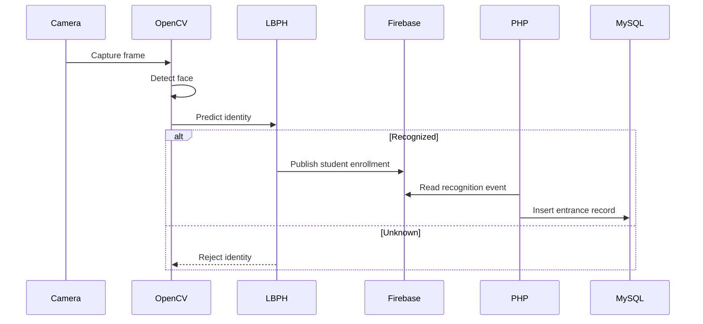
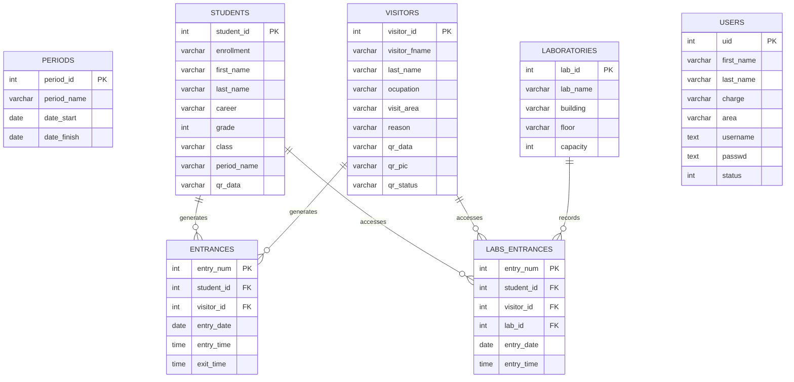

# SIVAL 2.0

**A hybrid university access-control system combining facial recognition, QR-based visitor authorization, access logging, and administrative reporting.**

> **SIVAL — Sistema de Validación del Alumnado**

[](https://www.php.net/)
[](https://www.python.org/)
[](https://opencv.org/)
[](https://www.mysql.com/)
[](https://firebase.google.com/)

## Demo

[▶ Watch the SIVAL project demo on YouTube](https://youtu.be/bDrF3uBNPPU)

<!-- Recommended:
docs/images/dashboard.png
docs/images/face-recognition.png
docs/images/visitor-qr.png
docs/images/reports.png
-->

---

## Problem

Universities need to validate who enters their facilities while keeping the process efficient for students, visitors, faculty, and security personnel.

Traditional approaches based exclusively on physical credentials or manual verification make it harder to:

* Validate a person's identity automatically.
* Track student access events.
* Control temporary visitor access.
* Monitor access to laboratories.
* Maintain an auditable access history.
* Generate reports from historical access data.

SIVAL explores a software-driven solution by combining **computer vision, QR validation, web administration, relational data, and event synchronization**.

---

## Solution

SIVAL is a hybrid access-control platform composed of a PHP web application and Python-based computer-vision services.

The system supports two primary validation flows:

### Students

Registered students can be identified using facial recognition.

Once a student is recognized, the recognition event is synchronized through Firebase and later persisted as an entrance event in MySQL.

### Visitors

Visitors are registered through the web platform and receive QR-based authorization.

Authorized QR codes can then be validated through the OpenCV scanner, producing visitor access logs.

Administrators can additionally manage:

* System users.
* Laboratories.
* Visitors.
* Access records.
* Filtered reports.
* Access analytics.

---

## Architecture

SIVAL uses a **hybrid event-driven architecture around an MVC-oriented PHP application**.



### Facial-recognition flow



### Repository structure

```text
SIVAL2.0/
├── bd/
│   └── bd_script.sql
│
├── detectors/
│   ├── face_recognizer.py
│   ├── frame_maker.py
│   ├── qr_detector.py
│   ├── trainer.py
│   └── requirements.txt
│
├── mvc/
│   ├── controllers/
│   │   ├── consult/
│   │   ├── laboratories/
│   │   ├── users/
│   │   └── visitors/
│   │
│   ├── models/
│   └── views/
│
├── static/
├── index.php
├── README.md
└── LICENCE
```

---

## Key Features

### Facial Recognition

The computer-vision module uses OpenCV to detect faces from a camera stream.

SIVAL uses an **LBPH (Local Binary Patterns Histograms) Face Recognizer** trained from previously captured facial samples.

Recognition results are published to Firebase so they can be consumed by the PHP application.

### Face Dataset Generation

`frame_maker.py` extracts and normalizes face samples from video input, creating the dataset used during model training.

### Model Training

`trainer.py` processes the captured face dataset and trains an OpenCV LBPH model persisted as:

```text
modeloLBPHFace.xml
```

### QR Visitor Validation

The visitor scanner uses OpenCV's:

```python
cv2.QRCodeDetector()
```

to decode QR credentials.

The decoded credential is checked against active visitors stored in Firebase.

### Access Logging

Recognized students can generate records in the MySQL `entrances` table containing:

* Student identity.
* Entry date.
* Entry time.
* Exit time.

### Laboratory Management

Administrators can create, read, update, and delete laboratory records containing:

* Laboratory name.
* Building.
* Floor.
* Capacity.

### Visitor Lifecycle

Visitors have an authorization state:

```text
pendient → active → expired
```

This allows the system to distinguish between requested, authorized, and expired QR credentials.

### Reporting

The reporting module can query entrance data and generate Excel reports programmatically with:

* `openpyxl`
* `PyMySQL`
* Excel bar charts

---

## Tech Stack

| Area                  | Technology                 |
| --------------------- | -------------------------- |
| Backend               | PHP                        |
| Computer Vision       | Python                     |
| Face Detection        | OpenCV Haar Cascades       |
| Face Recognition      | OpenCV LBPH                |
| QR Detection          | OpenCV QRCodeDetector      |
| Relational Database   | MySQL                      |
| Event Synchronization | Firebase Realtime Database |
| PHP Database Access   | PDO                        |
| Firebase Integration  | Firebase Admin SDK / REST  |
| Reporting             | Python, openpyxl, PyMySQL  |
| Frontend              | HTML, CSS, JavaScript      |
| Web Server            | Apache / XAMPP             |
| Version Control       | Git / GitHub               |

---

## Engineering Decisions

### Hybrid PHP + Python Architecture

PHP was used for the administrative web application and relational workflows, while Python was used for computer vision.

This allowed each subsystem to use libraries suited to its problem domain:

* PHP for web application workflows.
* Python/OpenCV for vision processing.

### Firebase as an Event Bridge

The recognition process and PHP application run as separate components.

Instead of tightly coupling them, facial-recognition results are written to Firebase Realtime Database.

The PHP application can then consume the recognition event and persist the corresponding entrance record in MySQL.

This provides a simple asynchronous communication mechanism between the Python and PHP subsystems.

### MVC-Oriented Web Application

The PHP application separates responsibilities into:

```text
controllers/
models/
views/
```

Models encapsulate persistence and external-data operations, controllers handle application workflows, and views render the administrative interface.

### Prepared SQL Statements

The PHP MySQL models primarily use PDO prepared statements:

```php
$query = "SELECT * FROM laboratories WHERE lab_id = ?;";
$cursor = $cnxn->prepare($query);
$cursor->execute([$lab_id]);
```

This separates query structure from user-supplied values and reduces SQL-injection exposure for those operations.

### Soft Deactivation for Users

Users are not permanently deleted from the database.

Instead, the system maintains a:

```text
status
```

attribute and deactivates users by setting it to `0`.

This preserves historical information while preventing inactive accounts from authenticating.

### Separate Visitor and Student Validation

SIVAL intentionally uses different access mechanisms for different identity lifecycles:

```text
Students → Facial Recognition
Visitors → Temporary QR Authorization
```

Students represent persistent institutional identities, while visitors require temporary authorization.

---

## API / Data Model

SIVAL is not implemented as a conventional REST API.

The application combines:

* PHP controllers.
* PHP models.
* MySQL queries.
* Firebase REST operations.
* Python Firebase clients.

### MySQL Data Model

The relational schema contains six main entities:



### Firebase Data

Firebase is used for transient and distributed application state including:

```text
/recData
/visitors
/logs
```

This provides communication between the computer-vision processes and the PHP application.

---

## Running Locally

### Prerequisites

You will need:

* PHP 7+
* Python 3
* MySQL
* Apache
* pip
* A Firebase project
* Webcam access

XAMPP can be used for the PHP/MySQL environment.

### 1. Clone the repository

```bash
git clone https://github.com/iAntonAMC/SIVAL2.0.git
cd SIVAL2.0
```

### 2. Configure the database

Create the MySQL database:

```sql
CREATE DATABASE sival;
```

Then execute:

```text
bd/bd_script.sql
```

### 3. Install Python dependencies

```bash
cd detectors
pip install -r requirements.txt
```

### 4. Configure Firebase

Create your own Firebase project and provide its credentials through local environment configuration.

**Never commit Firebase service-account credentials to Git.**

Configure the application with your Firebase Realtime Database URL.

### 5. Configure the PHP application

The legacy implementation expects the project to be available under:

```text
/SIVAL/
```

For XAMPP:

```text
htdocs/
└── SIVAL/
```

### 6. Start Apache and MySQL

Start both services using XAMPP or your preferred local environment.

### 7. Train the recognition model

Create the facial dataset and train the LBPH recognizer:

```bash
python frame_maker.py
python trainer.py
```

### 8. Start facial recognition

```bash
python face_recognizer.py
```

### 9. Run the QR scanner

```bash
python qr_detector.py
```

### 10. Open the web application

```text
http://localhost/SIVAL/
```

---

## Testing

The original project was primarily tested through manual end-to-end workflows rather than an automated testing suite.

Core scenarios include:

### Facial Recognition

```text
Capture face
    ↓
Train model
    ↓
Detect face
    ↓
Recognize student
    ↓
Publish Firebase event
    ↓
Persist MySQL entrance
```

### Visitor Authorization

```text
Register visitor
    ↓
Generate QR credential
    ↓
Approve visitor
    ↓
Scan QR
    ↓
Validate against Firebase
    ↓
Generate access log
```

### Recommended Automated Coverage

Future test coverage should include:

* Authentication.
* User CRUD operations.
* Laboratory CRUD operations.
* Visitor lifecycle transitions.
* Database persistence.
* Recognition-event processing.
* Invalid QR credentials.
* Expired QR credentials.
* Firebase failures.
* MySQL failures.
* Invalid form input.
* Authorization boundaries.

---

## Deployment

The original SIVAL implementation targets a traditional local Apache/PHP/MySQL environment.

A production-oriented version would separate the system into deployable components:

```text
Web Application
├── PHP application
└── MySQL

Computer Vision Service
├── Python
└── OpenCV

Event Infrastructure
└── Firebase Realtime Database
```

Production deployment should additionally provide:

* Environment-based configuration.
* HTTPS.
* Secret management.
* Password hashing.
* Database migrations.
* Centralized logging.
* Automated testing.
* CI/CD.
* Health checks.
* Backup strategies.
* Restricted database permissions.

---

## Challenges & Trade-offs

### Cross-Language Integration

The web platform and computer-vision subsystem use different languages and runtimes.

Firebase provides a lightweight synchronization mechanism between them, but introduces another infrastructure dependency.

A modern redesign could replace this mechanism with a dedicated API, message queue, or event service.

### Recognition Accuracy

LBPH is lightweight and works without specialized hardware, making it appropriate for a prototype.

Its performance, however, depends strongly on:

* Lighting.
* Camera quality.
* Training samples.
* Facial orientation.
* Recognition threshold.

A production system would require systematic accuracy evaluation and stronger biometric safeguards.

### Prototype Speed vs. Security

Several implementation choices optimized development speed during the prototype and hackathon phase.

A production version would need stronger controls around:

* Credentials.
* Password storage.
* Firebase permissions.
* Session management.
* Biometric information.
* Secrets management.
* Input validation.

### Relational Data + Realtime Events

SIVAL uses MySQL for durable institutional records while Firebase handles realtime synchronization.

This provides flexibility but creates two sources of application state that must remain consistent.

---

## Results

SIVAL evolved beyond a traditional CRUD university project by integrating:

* Full-stack web development.
* Computer vision.
* Facial recognition.
* QR validation.
* Relational database design.
* Realtime event synchronization.
* Access-event traceability.
* Automated Excel reporting.

### Recognition

| Event         | Year | Result    |
| ------------- | ---: | --------- |
| Hackaton UTVM | 2024 | 1st Place |

---

## My Contribution

SIVAL was developed collaboratively by:

* [Jesús Antonio Torres Fernández — @iAntonAMC](https://github.com/iAntonAMC)
* [José Rolando Granados Rivera — @GRJR1325](https://github.com/GRJR1325)

### Jesús Antonio Torres Fernández

My primary responsibilities included:

* Backend design and implementation.
* MVC-oriented application structure.
* PHP/MySQL integration.
* Computer-vision development using Python and OpenCV.
* Facial-recognition pipeline implementation.
* Engineering conventions and development guidelines.
* System integration between application components.

---

## Future Improvements

### Security

* [ ] Revoke and remove exposed Firebase credentials.
* [ ] Remove secrets from Git history.
* [ ] Introduce `.env`-based configuration.
* [ ] Hash passwords using modern password-hashing APIs.
* [ ] Harden PHP session management.
* [ ] Add CSRF protection.
* [ ] Review Firebase security rules.
* [ ] Define policies for biometric-data retention.

### Backend

* [ ] Upgrade to a supported PHP version.
* [ ] Introduce Composer.
* [ ] Add a centralized configuration layer.
* [ ] Fix inconsistent Firebase endpoints.
* [ ] Introduce database migrations.
* [ ] Standardize error handling.
* [ ] Add input validation.
* [ ] Introduce structured application logging.

### Architecture

* [ ] Extract computer vision into a dedicated service.
* [ ] Replace Firebase polling/state flags with explicit domain events.
* [ ] Introduce a REST API.
* [ ] Implement role-based access control.
* [ ] Containerize the application using Docker.
* [ ] Separate development, testing, and production environments.

### Quality

* [ ] Add PHPUnit tests.
* [ ] Add Python unit tests.
* [ ] Add integration tests.
* [ ] Add GitHub Actions.
* [ ] Add static analysis.
* [ ] Add formatting and linting.
* [ ] Track test coverage.

### Product

* [ ] Real-time access dashboard.
* [ ] Configurable access policies.
* [ ] Access analytics.
* [ ] Daily / weekly / monthly reports.
* [ ] Visitor expiration timestamps.
* [ ] Alerts for rejected access attempts.
* [ ] Multi-campus support.

---

## Authors

**Jesús Antonio Torres Fernández**
[@iAntonAMC](https://github.com/iAntonAMC)

**José Rolando Granados Rivera**
[@GRJR1325](https://github.com/GRJR1325)

---

## License

Distributed under the MIT License.

See [`LICENCE`](LICENCE) for details.
