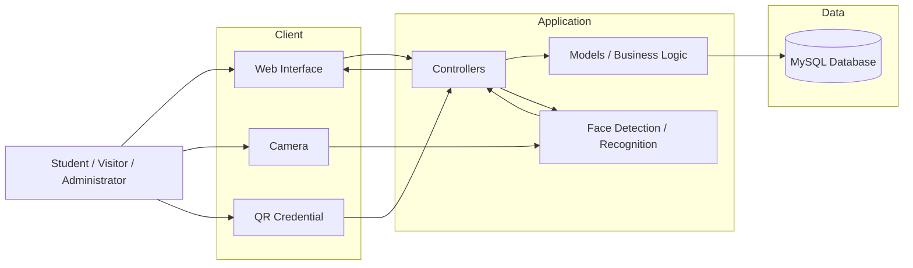
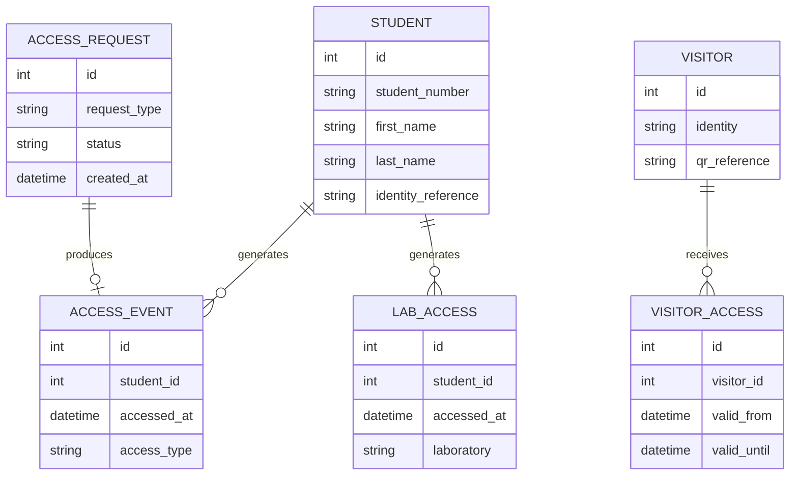

# SIVAL 2.0

**A university access-control system that combines facial recognition, QR-based visitor validation, and access logging to improve campus security.**

> SIVAL — *Sistema de Validación del Alumnado*

[](https://www.php.net/)
[](https://www.mysql.com/)
[](#architecture)
[](LICENSE)

## Demo

[Watch the SIVAL demonstration on YouTube](https://youtu.be/bDrF3uBNPPU)

<!-- Replace this section with screenshots from /docs/images -->


---

## Problem

Educational institutions need to control who enters their facilities while maintaining an efficient experience for students, staff, security personnel, and visitors.

Traditional access-control processes may depend on manual identity verification, physical credentials, or disconnected records. These approaches can make it difficult to:

* Verify whether a person is authorized to enter the institution.
* Track when students enter university facilities.
* Record access to restricted areas such as laboratories.
* Manage temporary visitors.
* Maintain a centralized history of access events.

SIVAL was designed to explore a software-based approach to this problem by combining identity management, facial recognition, QR validation, and access-event tracking in a single system.

---

## Solution

SIVAL (**Sistema de Validación del Alumnado**) is a web-based access-control platform built primarily with PHP and MySQL.

The system supports multiple validation workflows:

* Registered students can be identified through facial recognition.
* Visitors can be issued temporary QR-based credentials.
* Access events can be recorded with date and time information.
* Laboratory access can be tracked independently.
* Administrators can manage student information and review access activity.

Instead of treating access validation as a single authentication event, SIVAL models it as a broader workflow involving identity, authorization, validation, and traceability.

---

## Architecture

SIVAL follows a **Model-View-Controller-inspired architecture** to separate presentation, application flow, and data-access responsibilities.



### Repository structure

```text
SIVAL2.0/
├── bd/             # Database-related resources
├── detectors/      # Detection / facial-recognition components
├── mvc/            # Application MVC structure
├── static/         # Static frontend resources
├── index.php       # Application entry point
├── README.md
└── LICENSE
```

The project also defines development conventions for models, controllers, views, SQL queries, variables, functions, and internal routes.

---

## Key Features

### Facial recognition

SIVAL supports student identity validation through facial-recognition functionality, enabling an alternative to relying exclusively on physical credentials.

### Student management

Administrators can register students and associate institutional information with their system identity.

### University access logging

Student access events can be recorded with date and time information, creating an auditable history of entries.

### Laboratory access tracking

The system can separately record access to university laboratories and other controlled areas.

### QR-based visitor access

Visitors can be provided with QR-based credentials for temporary access workflows without registering them as permanent students.

### Access administration

The application provides centralized access-management functionality for reviewing and managing authorization workflows.

### Reporting foundation

The project was designed with access reporting in mind, including the ability to evolve toward daily, weekly, and monthly activity reports.

---

## Tech Stack

| Layer                   | Technology                         |
| ----------------------- | ---------------------------------- |
| Backend                 | PHP 7.x                            |
| Database                | MySQL 5.x                          |
| Frontend                | HTML, CSS, JavaScript              |
| Web Server              | Apache / Nginx                     |
| Architecture            | MVC                                |
| Identity validation     | Facial recognition / detection     |
| Visitor validation      | QR codes                           |
| Development environment | XAMPP-compatible local environment |
| Version control         | Git / GitHub                       |

---

## Engineering Decisions

### MVC-oriented separation of concerns

Application code is organized around models, views, and controllers rather than concentrating database operations, UI rendering, and request handling in the same files.

The project established naming conventions such as:

```text
Controllers:  action_entity
Models:       entity_model
Views:        entity_purpose
Functions:    camelCase
Variables:    snake_case
```

These conventions were introduced to improve consistency across a multi-developer codebase.

### Relational persistence

MySQL was selected to model students, identities, authorization information, and access events as structured relational data.

This makes access history queryable and provides a foundation for generating reports and performing administrative analysis.

### Multiple identity-validation mechanisms

SIVAL separates permanent users from temporary visitors.

Students can be validated using registered institutional information and facial recognition, while visitors can follow a QR-based temporary authorization workflow.

This avoids forcing fundamentally different identity types into the same validation mechanism.

### Traceability over binary authentication

The system does not only answer:

> “Is this person authorized?”

It also records access activity.

This turns identity validation into an auditable event and creates the foundation for security analysis and institutional reporting.

### Browser-based interface

The system was implemented as a web application so that access-control and administrative interfaces can be used without requiring a dedicated client application.

---

## API / Data Model

SIVAL 2.0 is primarily implemented as a PHP web application rather than as a standalone public REST API.

Application requests are processed through controllers, which coordinate domain operations and persistence.

### Conceptual domain model



> The diagram represents the high-level SIVAL domain. Exact table and column names should be checked against the SQL schema when extending the system.

### Main application flows

#### Student validation

```text
Camera input
    ↓
Face detection / recognition
    ↓
Identity lookup
    ↓
Student validation
    ↓
Access authorization
    ↓
Access event persisted
```

#### Visitor validation

```text
Visitor registration
    ↓
Temporary authorization
    ↓
QR credential
    ↓
QR validation
    ↓
Access event
```

---

## Running Locally

### Prerequisites

Install:

* PHP 7.x
* MySQL 5.x
* Apache or Nginx

For a simple local setup, XAMPP can be used.

### 1. Clone the repository

```bash
git clone https://github.com/iAntonAMC/SIVAL2.0.git
```

### 2. Move into the project

```bash
cd SIVAL2.0
```

### 3. Configure the web server

When using XAMPP, place the project inside the Apache document root.

For example:

```text
xampp/
└── htdocs/
    └── SIVAL/
```

The current application uses `/SIVAL/` as its base path.

### 4. Configure MySQL

Create the required MySQL database and import the SQL resources contained in the `bd/` directory.

Update the application's database configuration with your local credentials.

### 5. Start the services

Start:

```text
Apache
MySQL
```

### 6. Open the application

Navigate to:

```text
http://localhost/SIVAL/
```

### 7. Configure camera access

Allow browser camera access when testing facial-validation functionality.

---

## Testing

The original SIVAL 2.0 implementation was primarily validated through end-to-end application workflows.

Important scenarios include:

```text
Student registration
        ↓
Identity registration
        ↓
Facial validation
        ↓
Authorization decision
        ↓
Access-event persistence
```

and:

```text
Visitor registration
        ↓
QR generation
        ↓
QR validation
        ↓
Temporary access
```

### Recommended automated test coverage

Future versions should introduce automated coverage for:

* Student CRUD operations.
* Authentication and authorization.
* Database persistence.
* Invalid identity attempts.
* Facial-recognition failure scenarios.
* Duplicate access events.
* QR expiration.
* Invalid QR credentials.
* Database connectivity failures.
* Input validation.

---

## Deployment

SIVAL can be deployed on a conventional PHP hosting environment containing:

```text
Web Client
    ↓
Apache / Nginx
    ↓
PHP Application
    ↓
MySQL
```

A production deployment should additionally introduce:

* Environment-based configuration.
* HTTPS.
* Secure database credentials.
* Restricted database permissions.
* Application logging.
* Server-side validation.
* CSRF protection.
* Secure session handling.
* Backup policies.
* Database migrations.
* CI/CD validation.

Because facial information represents sensitive biometric data, a production implementation should also define explicit retention, encryption, access-control, and privacy policies.

---

## Challenges & Trade-offs

### Facial recognition vs. traditional credentials

Facial recognition can make identity validation more convenient, but introduces additional complexity involving camera quality, lighting conditions, recognition accuracy, privacy, and biometric-data management.

### Security vs. usability

An access-control system must make unauthorized access difficult without introducing excessive friction for legitimate students and staff.

SIVAL explores this balance through automated identity validation.

### Permanent users vs. temporary visitors

Students and visitors have different identity lifecycles.

Using facial identity for enrolled students while providing QR-based authorization for visitors allows the application to support both workflows without requiring the same enrollment process.

### Legacy deployment assumptions

The current version was built around a traditional PHP/XAMPP environment and absolute `/SIVAL/` application paths.

This simplified the original deployment environment but reduces portability compared with environment-driven configuration or containerized deployment.

### Prototype scope vs. production security

SIVAL was developed as an academic and hackathon-oriented engineering project.

A production access-control platform would require additional work around:

* Biometric-data security.
* Authentication hardening.
* Authorization policies.
* Audit logging.
* Error handling.
* Automated testing.
* Observability.
* Scalability.
* Regulatory and privacy compliance.

---

## Results

SIVAL evolved beyond a conventional CRUD academic project by integrating:

* Web application development.
* Relational database design.
* Computer-vision-based identity validation.
* QR-based temporary authorization.
* Access-event traceability.
* MVC-oriented application structure.

The project was also presented in competitive hackathon environments.

### Recognition

<!-- Replace these placeholders with the exact hackathon information. -->

| Event              |   Year | Result                         |
| ------------------ | -----: | ------------------------------ |
| `Hackaton UTVM` | `2024` | `1st Place` |

---

## My Contribution

SIVAL was developed collaboratively by:

* [Jesús Antonio Torres Fernández — @iAntonAMC](https://github.com/iAntonAMC)
* [José Rolando Granados Rivera — @GRJR1325](https://github.com/GRJR1325)

### Jesús Antonio Torres Fernández

- Designed the Backend for the system
- Developed the computer vision feature, using OpenCV on Python
- Refactored developer guidelines

---

## Future Improvements

### Engineering

* [ ] Upgrade the runtime to a currently supported PHP version.
* [ ] Introduce Composer for dependency management.
* [ ] Centralize application configuration.
* [ ] Replace hard-coded routes with configurable base URLs.
* [ ] Introduce environment variables with `.env.example`.
* [ ] Add database migrations.
* [ ] Standardize exception and error handling.
* [ ] Introduce structured logging.
* [ ] Add unit and integration tests.
* [ ] Add GitHub Actions CI.

### Architecture

* [ ] Separate biometric processing behind a dedicated service boundary.
* [ ] Define a formal application/service layer.
* [ ] Expose selected functionality through a REST API.
* [ ] Introduce role-based access control.
* [ ] Improve domain modeling for access policies.
* [ ] Containerize the application using Docker.

### Security

* [ ] Harden authentication and session management.
* [ ] Add CSRF protection.
* [ ] Audit SQL queries and parameterize database operations.
* [ ] Implement rate limiting where appropriate.
* [ ] Encrypt sensitive data.
* [ ] Define biometric-data retention policies.
* [ ] Introduce audit logs for administrative actions.

### Product

* [ ] Real-time security dashboard.
* [ ] Configurable access policies.
* [ ] Access analytics.
* [ ] Daily / weekly / monthly reports.
* [ ] Visitor credential expiration.
* [ ] Notifications for rejected access attempts.
* [ ] Multiple campus / building support.

---

## Authors

**Jesús Antonio Torres Fernández**
GitHub: [@iAntonAMC](https://github.com/iAntonAMC)

**José Rolando Granados Rivera**
GitHub: [@GRJR1325](https://github.com/GRJR1325)

---

## License

This project is distributed under the MIT License.

See [`LICENSE`](LICENSE) for more information.

---

## Project Demo

**SIVAL — Sistema de Validación del Alumnado**

[▶ Watch the project demonstration](https://youtu.be/bDrF3uBNPPU)
